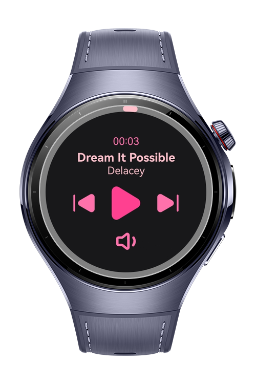
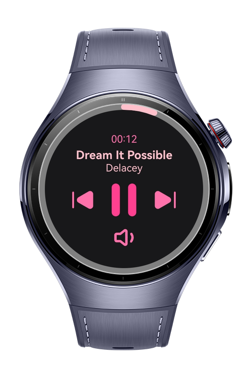
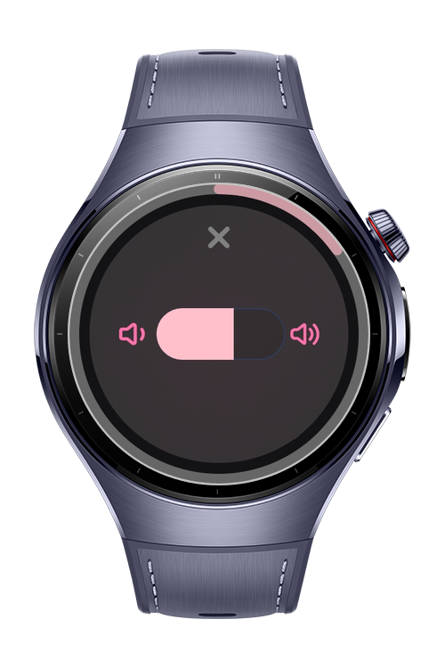
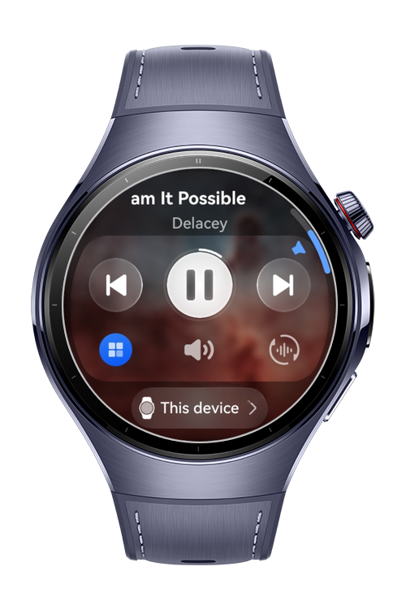

> **Note:** To access all shared projects, get information about environment setup, and view other guides, please visit [Explore-In-HMOS-Wearable Index](https://github.com/Explore-In-HMOS-Wearable/hmos-index).

# Crown Music

Crown Music is a wearable music player app built with ArkTS and ArkUI, specifically optimized for HarmonyOS smartwatches. It offers a seamless audio experience with circular screen support, background playback, and intuitive crown button integration for full control — right from your wrist.

-----
# Preview

<div>
	
	
	
	
</div>
---

# Use Cases

1. Real-Time Music Playback: Users can play and pause music seamlessly. The app continues playback in the background for uninterrupted listening.
2. Crown Button Control: Users can control playback with the smartwatch crown button, enabling track skipping and play/pause without touching the screen.
3. Circular Progress UI: Users can track song progress visually with a circular arc-based UI optimized for HarmonyOS round displays.
4. Custom Volume Dialog: Users can adjust music volume quickly with a custom dialog that updates in real-time to reflect the current level.
5. Background Resume Playback: When users return to the app from the background, music playback state and progress are restored seamlessly.
6. Lock Screen Control: Users can control playback (play/pause, skip) directly from the smartwatch lock screen.

------
# Tech Stack

- Languages: ArkTS (Ark TypeScript)

- Frameworks: HarmonyOS SDK 5.1.0 (API Version 18)

- Tools: DevEco Studio Version 5.1.0.842

- Libraries & Kits:
	- `@kit.MediaKit` – For handling audio playback functions such as play, pause, and track navigation.

	- `@kit.AudioKit` – To manage audio streams and device volume control.

	- `@kit.BackgroundTasksKit` – Ensures music continues to play even if the app moves to the background.

	- `Crown Event methods` – Enables hardware crown interactions to skip or control playback and volume synchronously.
    
 ---
 # Project Directory

```
|---audio
|   |---AVSessionController.ets   # Manages AV session control for playback
|   |---BackgroundUtil.ets        # Handles logic for background playback support
|   |---CustomAudioManager.ets    # Centralized manager for audio-related operations
|   |---MediaController.ets       # Controls media playback actions like play, pause, skip
|   |---MediaTools.ets            # Helper functions for audio handling

|---common
|   |---constants
|   |   |---MusicData.ets             # Represents daily or session-based music 

|   |---model
|   |   |---MusicModel.ets            # Data model for a single music track

|   |---util
|   |   |---CustomDialogVolume.ets    # Custom volume dialog for real-time volume control

|---pages
|   |---Index.ets                 # App entry point and routing logic
|   |---PlaybackPage.ets          # Main UI for playback and interaction

|---viewmodel
|   |---MainViewModel.ets         # Manages playback state and view-related logic
```

---

# Constraints and Restrictions

## Supported Devices

- Huawei Watch 5
- Devices running HarmonyOS 5.1.0 (API 18) and above

---

# Licence

SmartWord is distributed under the terms of the MIT License
See the [LICENSE](./LICENSE) for more information.